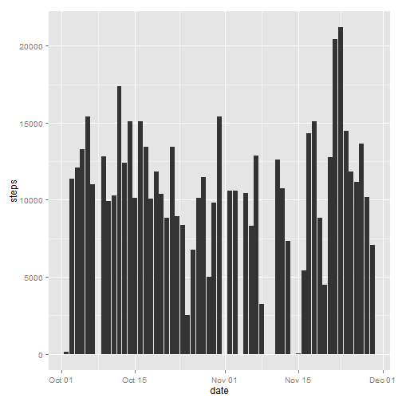
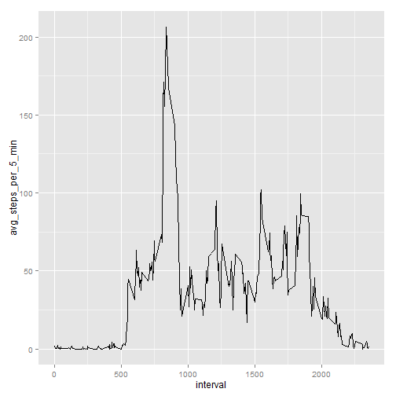
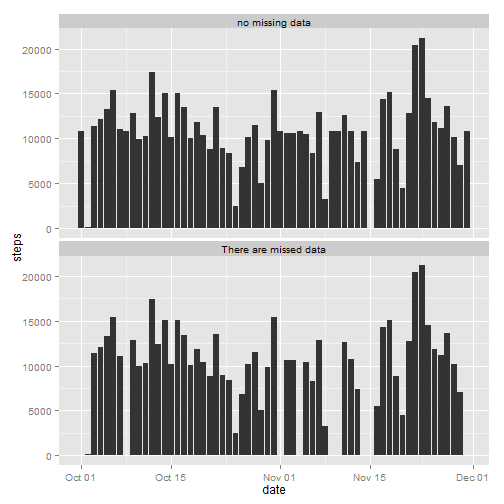
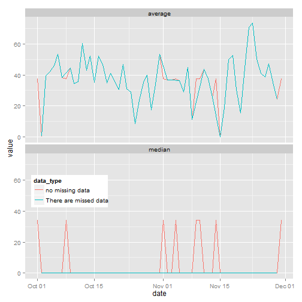
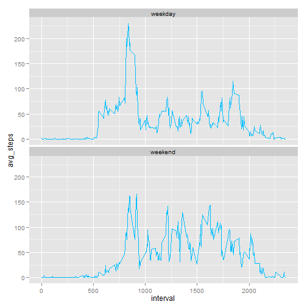

---
 "reproducible_assignment1"
---
## Reproducible Research Course Assignment
 
**Assignment: Loading and preprocessing the data**

set current working directory, then load neccessary packages:

```r
cwd <-  'C:\\git\\reproducible\\assignment1'
setwd(cwd)
getwd()
library(ggplot2)
library(dplyr)
```

```
## 
## Attaching package: 'dplyr'
## 
## The following object is masked from 'package:stats':
## 
##     filter
## 
## The following objects are masked from 'package:base':
## 
##     intersect, setdiff, setequal, union
```

```r
library(tidyr)
```
1.Load the data

```r
csv_data <-  read.csv('activity.csv')
csv_data$date <- as.Date(csv_data$date)
head(csv_data)
tail(csv_data)
summary(csv_data)
str(csv_data)
```
2.Process/transform the data (if necessary) into a format suitable for your analysis

```r
clean_data <- na.omit(csv_data)
summary(clean_data)
str(clean_data)
```
**
What is mean total number of steps taken per day?**
For this part of the assignment, you can ignore the missing values in the dataset.
1.Make a histogram of the total number of steps taken each day

```r
ggplot(data=clean_data, aes(x=date, y=steps)) + geom_histogram(stat="identity")
```

 

```r
day_by_day_report <- clean_data %>%
    group_by(date) %>%
    summarise(steps_per_day = sum(steps))
```
2.Calculate and report the mean and median total number of steps taken per day
*summary() function can easily make the mean and median report*

```r
summary(day_by_day_report)
```

```
##       date            steps_per_day  
##  Min.   :2012-10-02   Min.   :   41  
##  1st Qu.:2012-10-16   1st Qu.: 8841  
##  Median :2012-10-29   Median :10765  
##  Mean   :2012-10-30   Mean   :10766  
##  3rd Qu.:2012-11-16   3rd Qu.:13294  
##  Max.   :2012-11-29   Max.   :21194
```
**Assignment: What is the average daily activity pattern?**
1.Make a time series plot of the 5-minute interval (x-axis) and the average number of steps taken, averaged across all days (y-axis)

```r
daily_pattern <- clean_data %>%
    group_by(interval) %>%
    summarise(avg_steps_per_5_min = mean(steps)) 
p <- ggplot(data=daily_pattern, aes(x=interval, y=avg_steps_per_5_min)) 
p <- p + geom_line()
p
```

 

2.Which 5-minute interval, on average across all the days in the dataset, contains the maximum number of steps?

```r
daily_pattern %>%
    filter(interval, avg_steps_per_5_min == max(avg_steps_per_5_min))
```

```
## Source: local data frame [1 x 2]
## 
##   interval avg_steps_per_5_min
## 1      835            206.1698
```
so, around 08:35 is generally the most walking time.

**Imputing missing values**
Note that there are a number of days/intervals where there are missing values (coded as  NA ). The presence of missing days may introduce bias into some calculations or summaries of the data.
*My strategy is to filling all the NA values with the mean value of the 5-minute interval.*
1.Calculate and report the total number of missing values in the dataset (i.e. the total number of rows with  NA s)

```r
na_data <- csv_data[is.na(csv_data['steps']),]
nrow(na_data)
```

```
## [1] 2304
```
There are 2304 observes contains NA value.
2.Devise a strategy for filling in all of the missing values in the dataset. The strategy does not need to be sophisticated. For example, you could use the mean/median for that day, or the mean for that 5-minute interval, etc.

```r
filled_na_data <- 
      merge(na_data, daily_pattern, by = 'interval') %>%
      select(avg_steps_per_5_min, date, interval)
```
3.Create a new dataset that is equal to the original dataset but with the missing data filled in.

```r
names(filled_na_data ) <- names(clean_data)
filled_data <- rbind(filled_na_data, clean_data)
```
4.Make a histogram of the total number of steps taken each day and Calculate and report the mean and median total number of steps taken per day. Do these values differ from the estimates from the first part of the assignment? What is the impact of imputing missing data on the estimates of the total daily number of steps?
*To make the compare, it's easier to combine the filled and unfilled data togeter:*

```r
data_type <-  rep('no missing data', nrow(filled_data))
filled_data <- cbind(filled_data, data_type)
data_type <-  rep('There are missed data', nrow(clean_data))
clean_data <- cbind(clean_data, data_type)
compare_data <- rbind(filled_data, clean_data)
ggplot(data=compare_data, aes(x=date, y=steps)) + 
      geom_histogram(stat="identity") +
      facet_wrap(~data_type, nrow=2)
```

 

```r
compare_report <- compare_data %>%
      group_by(date, data_type) %>%
      summarise(average=mean(steps), median=median(steps)) %>%
      gather(calculate, value, average, median)
ggplot(data=compare_report, aes(x=date, y=value, colour=data_type)) + 
      geom_line() + 
      facet_wrap(~calculate, nrow=2) +
      theme(legend.position=c(0,0.3), legend.justification=c(0,0.3))
```

 

It seems the NA values have no significint impact on average value. However, it changed the median value a lot.

**Are there differences in activity patterns between weekdays and weekends?**
For this part the  weekdays()  function may be of some help here. Use the dataset with the filled-in missing values for this part.
1.Create a new factor variable in the dataset with two levels -- "weekday" and "weekend" indicating whether a given date is a weekday or weekend day.

```r
weekdays <- data.frame(
      type=c("weekday", "weekday", "weekday", "weekday", "weekday", "weekend", "weekend"),
      day= c("Monday", "Tuesday", "Wednesday", "Thursday", "Friday", "Saturday", "Sunday")
      )
filled_data <- filled_data %>% 
      mutate(day = weekdays(date))
filled_data <- merge(filled_data, weekdays, by='day')
daily_pattern_filled <- filled_data %>%
    group_by(interval, type) %>%
    summarise(avg_steps = mean(steps)) 
```
2.Make a panel plot containing a time series plot (i.e.  type = "l" ) of the 5-minute interval (x-axis) and the average number of steps taken, averaged across all weekday days or weekend days (y-axis). The plot should look something like the following, which was created using simulated data:

```r
ggplot(data=daily_pattern_filled, aes(x=interval, y=avg_steps)) + 
      geom_line(color='deepskyblue') + 
      facet_wrap(~type, nrow=2)
```

 

People are lazy at the weekend morning. However they move more at daytime.

